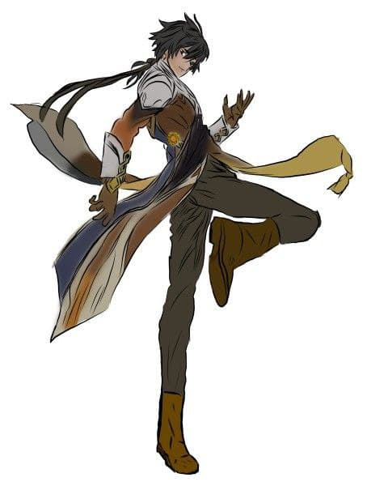

# Alfons Call'urha

Figlio di guardie reali, cresciuto giocando con i bambini della via dove abitava ad Astora.

Quando avevo 14 anni mia madre partì per una missione insieme a una squadra di dieci uomini verso Petite Londo; di loro
tornarono solo due guardie, spiegando che mia madre era diventata una non morta.

A 16 anni iniziai a seguire un guerriero del sole, **Donn**, che mi fece da maestro per tre lunghi anni, finché non divenni anche io
un **guerriero del sole**. 

Lo seguii per svolgere missioni in giro per il mondo, ma non andammo mai a Lordran: il mio
maestro non voleva andarci.

Con lui intanto si erano uniti altri tre apprendisti ed eravamo diventati una famiglia finché un demone toro non uccise tutti gli
altri apprendisti: il mio maestro mi spinse via e mi disse di scappare mentre lui sarebbe rimasto a combattere col
demone.

Fuggii per cercare rinforzi e fortunatamente trovai delle guardie non molto distanti da lì, ma al nostro ritorno non vi
era traccia ne del demone ne del mio maestro.

Sono passati altri due anni da allora e sono tornato ad Astora per imparare miracoli curativi, per compiere missioni,
cacciare banditi e **aiutare** chiunque avesse bisogno.

Adesso ho 21 anni, e sovente persino la guardia reale stessa chiede i miei servigi per delle spedizioni.

