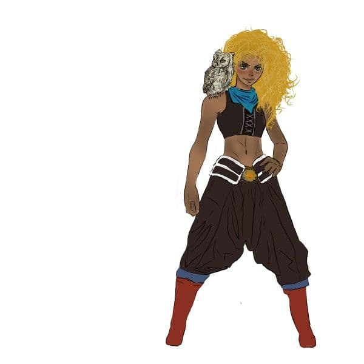

# Diana Esposis

Non so nulla sulla mia nascita e neanche quando sono nata, so solo che sono stata trovata da **padre Loria** davanti al
suo convento.

Sono cresciuta in orfanotrofio, ma non avevo molti amici per via del mio carattere schivo e aggressivo, anzi questo fece
sì che io crescessi in mezzo a molte risse.

La mia unica amica era la mia **civetta Galastor**: la trovai ferita nel giardino del mio orfanotrofio e la crebbi di
nascosto condividendo con lei tutto ciò che avevo.

All'età di 15 anni il sacerdote che io consideravo come un padre disse al suo amico **Igor** che lavorava come cavaliere
della corona di prendermi sotto la sua ala per insegnarmi a usare aggressività e forza con saggezza e con tecniche di
combattimento più avanzate cosicche' un giorno potessi arrivare a far parte del esercito del re sotto giuramento.

Al età di 18 anni Igor incominciò a farmi sempre più pressioni per il giuramento che dovevo dare al mio sovrano ma io
non condividevo questo suo ideale così ignoravo le sue prediche, finché un giorno presi la mia scelta: dissi a Igor che
non ero nata per sottostare a qualcun'altro e che preferivo combattere per i miei ideali, così feci la scelta di
diventare un guerriero del sole.

